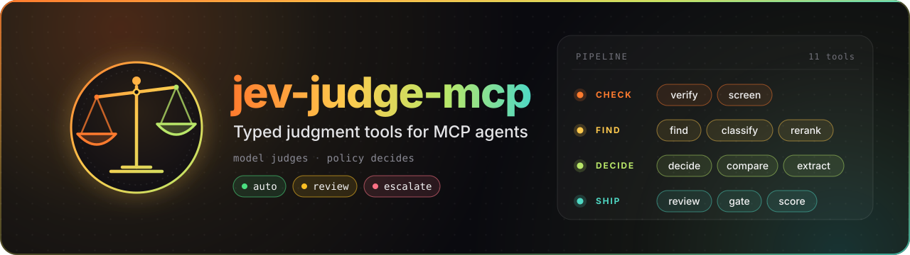

<div align="center">


### Think first, then code.

Open-source tools for coding agents, UI engineering, and verifiable AI workflows.

[Website](https://pymodel.com) · [Explore all repositories](https://github.com/orgs/PyModel/repositories) · [Contact](mailto:hello@pymodel.com)

</div>

## Featured

<a href="https://github.com/PyModel/jev-judge-mcp"></a>

```sh
uvx --from 'jev-judge-mcp[typesafe]' jev-judge-mcp setup     # verify and store your TypeSafe key
uvx --from 'jev-judge-mcp[typesafe]' jev-judge-mcp install   # add the server to your agents
uvx --from 'jev-judge-mcp[typesafe]' jev-judge-mcp doctor    # check the configuration, offline
```

Works with Claude Code, Claude Desktop, Codex, Cursor, OpenCode, Pi, omp, and Pythinker.

## Projects

### Coding agents

- [**pythinker-code**](https://github.com/PyModel/pythinker-code): our flagship terminal agent, with editor support over ACP
- [**pythinker-cli**](https://github.com/PyModel/pythinker-cli): review-first shell agent that scans and debugs before it writes
- [**claude-architect**](https://github.com/PyModel/claude-architect): Claude Code delegates to isolated CLI agents, then verifies before you merge
- [**claude-agy-mcp**](https://github.com/PyModel/claude-agy-mcp): Claude Code to Antigravity CLI bridge with model fallback

### UI and frontend

- [**designer-skill**](https://github.com/PyModel/designer-skill): UI design tools for any coding agent, installed in one line
- [**css-pro-tips**](https://github.com/PyModel/css-pro-tips): Baseline-aware modern CSS guidance, loaded on demand
- [**niblet-skill-mcp**](https://github.com/PyModel/niblet-skill-mcp): design skill and MCP server that ground agent-built UI in real screens
- [**react-frontend-skills**](https://github.com/PyModel/react-frontend-skills): React 19, Next.js 16, TypeScript, and testing skills

### Verification and privacy

- [**code-max**](https://github.com/PyModel/code-max): skill that requires real test evidence before an agent claims done
- [**done-means-done**](https://github.com/PyModel/done-means-done): a task record and Stop hook that send agents back to unfinished work
- [**watermark-remover**](https://github.com/PyModel/watermark-remover): cleaner for hidden Unicode, token watermarks, and C2PA/EXIF metadata in your files

## Work with us

Found a bug or have an idea? Open an issue in the relevant repository. For AI and machine learning work, contact [hello@pymodel.com](mailto:hello@pymodel.com) or visit [pymodel.com](https://pymodel.com).
